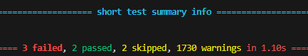

# SLAM Unit Test
Credit Tin Tran

## Usage
This unit test is used to evaluate your `robot.py` and `EKF.py`. Successfully passing the unit test will give you a good indication that you have implemented SLAM correctly, and may procede to the next tasks. Otherwise, the test report will let you know which part you should be looking into for a correct SLAM implementation.

## Preparation
1. Copy from your `Week02-04` folder into this folder, `SLAM_unit_test`, the following files and folders:
    * `operate.py`
    * `calibration`
    * `slam`
    * `util`
    * `pics`

2. Replace your baseline and scale with the provided [baseline.txt](./baseline.txt) and [scale.txt](./scale.txt).

3. Activate your virtual environment.

4. Install package `pytest` using
```
python -m pip install pytest
```
## Run test
From this folder, `SLAM_unit_test`, run the following command

```
pytest test -r s
```

If you want succint output, run
```
pytest --tb=line test -r s
```
Have a look at your outputs to check if your SLAM is correct, or what function you need to look into. Your results should look something like this.


