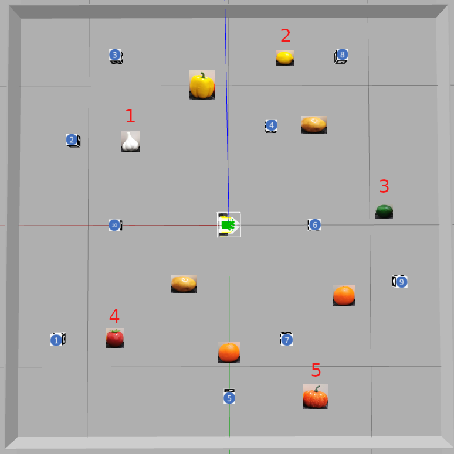

# Milestone 4: Navigation and Planning
- [Introduction](#Introduction)
- [Waypoint navigation (Week 7)](#waypoint-navigation-week-7)
- Path planning
	- [with a known map (Week 8)](#path-planning-with-a-known-map-week-8)
	- [with a partially known map (Week 8)](#path-planning-with-a-partially-known-map-week-8)
- Evaluation and marking: see [M4 marking instructions](M4_marking.md)

**[NEW] Please note that all skeleton codes provided are for references only and are intended to get you started. They are not guaranteed to be bug-free either. To get better performance please make changes or write your own codes and test cases. As long as your codes perform the task and generate estimation maps that can be marked according to the evaluation schemes and scripts you are free to modify the skeleton codes.**

---

## Introduction
In M4 you will implement the grocery shopping module for the robot. PenguinPi will be given a shopping list and it will need to navigate to the listed fruits&vegs in the supermarket. 

In the 3m x 3m arena, there will be 10 ArUco markers and 10 fruits&vegs. The shopping list will contain 5 of the 10 fruits&vegs present in the arena. The remaining 5 fruits&vegs are considered obstacles. **The 5 targets will be of unique types and there will be only one of each target fruit&vegs in the arena.** There may be more than one of a type of fruit/veg as obstacles. 
For example, in an arena containing 1 lemon, 1 lime, 1 garlic, 1 pumpkin, 1 tomato, 1 capsicum, 2 pear, 2 plum, your robot's given shopping list may be "garlic, lemon, lime, tomato, pumpkin", with the capsicum, pear, and plum as the obstacle. As there are duplicates of plum and pear, the shopping list won't contain pear or plum.

Since M4 focuses on testing your navigation and planning algorithms, we provide you with the groundtruth map of the arena. The repo contains map of a practice arena, slightly different marking arenas will be set up for M4 live demo marking and their true maps will be provided to you at the start of each M4 marking lab. You can either perform M4 with this fully known map, or with a partially known map if you are up for a challenge: 
- Full map: containing groundtruth locations of all 10 ArUco markers and all 10 fruits&vegs in the arena
- Partial map: containing groundtruth locations of all 10 ArUco markers, as well as locations of the 5 target fruits&vegs on PenguinPi's shopping list. The remaining 5 fruits&vegs will be considered as obstacles with unknown locations that your navigation and planning algorithm needs to handle. 

### M4 task
Given a shopping list of 5 fruits&vegs, the robot's task is to autonomously navigate to the given list of target fruits&vegs in the specified order, while avoiding obstacles (ArUco marker blocks and non-target objects) along the way. The **entire** robot needs to stop within a **0.5m radius** of a target for **2 seconds** (timing does not need to be exact, as long as the robot stops) before continuing its navigation to qualify as successfully navigated to that target. The **whole of the robot** needs to be within the 0.5m radius to qualify as success

To achieve the M4 task, this grocery shopping module can be divided into 3 components. These components build on top of each other, so we highly recommend you to complete these components in the following order:

1. [Level 1: Waypoint navigation](#waypoint-navigation-week-7)
2. [Level 2: Path planning (known map)](#path-planning-with-a-known-map-week-8)
3. [Level 3: Path planning (partially known map)](#path-planning-with-a-partially-known-map-week-8)

### Skeleton code
[auto_fruit_search.py](auto_fruit_search.py) is provided to you as a skeleton code to get you started. It requires the [utility scripts](../Week00-01/util) from M1 and the wheel and camera [calibration parameters](../Week02-04/calibration/param/) to run. 

Please note that this skeleton code is only a general guide, you can rewrite the whole script if you want. You may also submit multiple scripts/variants of this code for the different marking levels you wish to attempt as described in the [marking scheme](M4_marking.md#evaulation).

**Important notes:**
- There is a 2pt penalty for every marker or object that the robot collides into. There is also a 5pt penalty for exceeding the arena boundaries. A run with 3 penalties will be terminated. Make sure your implementation handles collision avoidance and the planned paths are within the arena boundaries.
- The groundtruth maps are provided to you for M4 ONLY (you may choose not use it). Please be aware that in future milestones you will need to generate your own map estimated using your M2&M3 implementation.
- There are two true maps provided **for the practice arena** (different maps will be used during marking):
	1. [M4_prac_map_full.txt](M4_prac_map_full.txt) - contains 10 fruits&vegs + 10 markers, it is used for 
		- setting up the arena
		- the true map input for Level 1 and Level 2 (refer to [marking scheme](#marking-schemes) for the level definitions)	
	2. [M4_prac_map_part.txt](M4_prac_map_part.txt) - contains 5 target fruits&vegs + 10 markers, it is used for 
		- the true map input for Level 3 (refer to [marking scheme](#marking-schemes) for the level definitions)
- In addition to the groundtruth map for the practice arena, the [M4_prac_shopping_list.txt](M4_prac_shopping_list.txt) is also provided to you.
- Below is a preview of the practice arena and the order of targets the robot needs to navigate to.

---

## Waypoint navigation (Week 7)
As a starting point to complete the M4 task, you will need to develop a module to accept a list of waypoints as input to navigate the robot to the goal position. **You are not allowed to teleoperate the robot.** If you wish to demonstrate this component alone, you may manually enter the target waypoints. Otherwise, this module will take the output of the [path planning module](#path-planning-with-a-known-map-week-8) as input. 

**Key functions to complete in [auto_fruit_search.py](auto_fruit_search.py):**
1. Control the robot to drive towards a waypoint at [line 108-124](auto_fruit_search.py#L108)
2. Estimate the robot's pose at [line 130-136](auto_fruit_search.py#L130)
	- We strongly recommend you to use your SLAM code from M2 to estimate the robot's pose. If you choose to do so, you will have to copy the necessary SLAM related functions in [operate.py](../Week02-04/operate.py) and the [slam scripts](../Week02-04/slam) from M2

**Additional suggestions:**
- Although it is possible to estimate the robot's pose with odometry (a much simpler implementation), we **STRONGLY RECOMMEND** you to correct the robot's pose after every waypoint navigation step with information from the SLAM module (M2)
- If you wish to demonstrate this component alone, you may implement one of the following to assist you with the demo
	- *Command line waypoint input*: a command line interface to continuously take waypoints as inputs so that you can guide the robot to get to the goal manually 
	- *GUI waypoint input*: a visual-based waypoints selector (with OpenCV or Pygame), so that you can visually select where the robot should go instead of estimating numerical values of the goal coordinates. However this will require more work 
	- *GUI target visualisation*: a visualisation to show the sequence of targets the robot needs to navigate to on the map and the 0.5m radius around each target, so that you can specify the waypoints more easily

---

## Path planning with a known map (Week 8)
Once you have completed the waypoint navigation function, you can implement a path planning algorithm to allow the robot to generate a path (a set of waypoints) and autonomously navigate to the goal. 

To perform the navigation, your codes should only take the [full groundtruth map](M4_prac_map_full.txt) as its input, where the locations of all the objects (10 ArUco markers and 10 fruits&vegs) in the arena are stored. It is best to have the file path of the map as an input argument for the Python script. **Once the Python script has started, you can enter no more than one command for the robot to start its navigation.** 

For this component, we assume the positions of all the objects in the arena are known upfront. The robot only needs to perform the path planning once at the start, but it can correct its path along the way using visual information to estimate if it has gone off-course (you are NOT allowed to manually instruct the robot that it's gone off-course and a re-planning is needed). 

You may use any path planning algorithms you prefer, such as rapidly exploring random trees (RRT) or A*, whether they are covered in the workshop or not. While we give you the true maps and shopping list beforehand, **you are NOT allowed to hard-code a list of waypoints or teleoperate the robot**. Your path planning algorithm should be the one navigating your robot around. 

---

## Path planning with a partially known map (Week 8)
In this component, 5 obstacle fruits&vegs at locations unknown to the robot is present in the arena in addition to the 5 target fruits&vegs that the robot needs to navigate to. 

To perform the navigation, your codes should only take the [partial groundtruth map](M4_prac_map_part.txt), where the locations of some of the objects (10 ArUco markers and 5 target fruits&vegs) in the arena are stored as input. **Once the Python script has started, you can enter no more than one command for the robot to start its task. You are not allowed to hard-code the waypoints or teleoperate the robot.**

Building on top of the components described above, you will need to include
1. A grocery detector (implemented in M3) to detect and estimate the location of the 5 obstacles, whose locations are initially unknown to the robot
2. Re-plan the robot's trajectory once an obstacle (new object) has been detected

